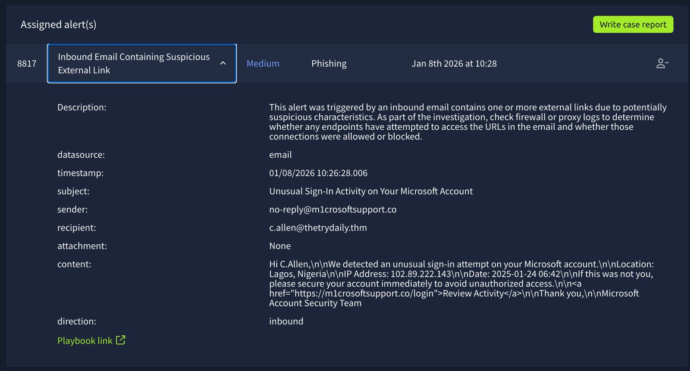
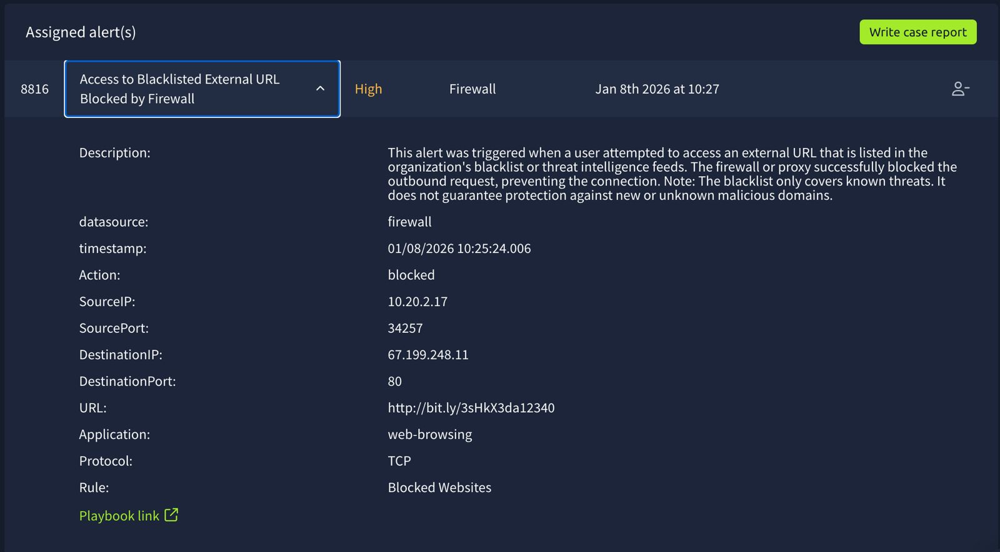
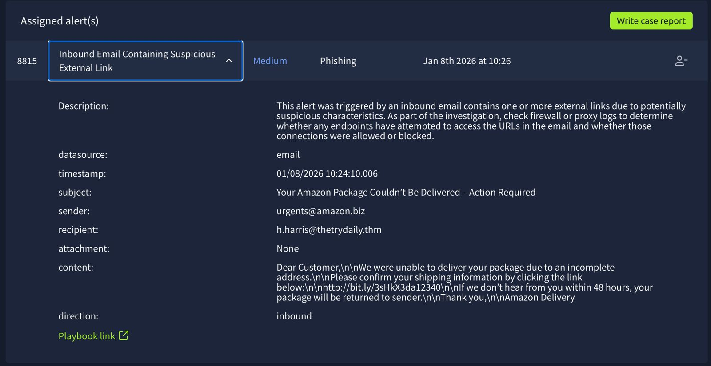
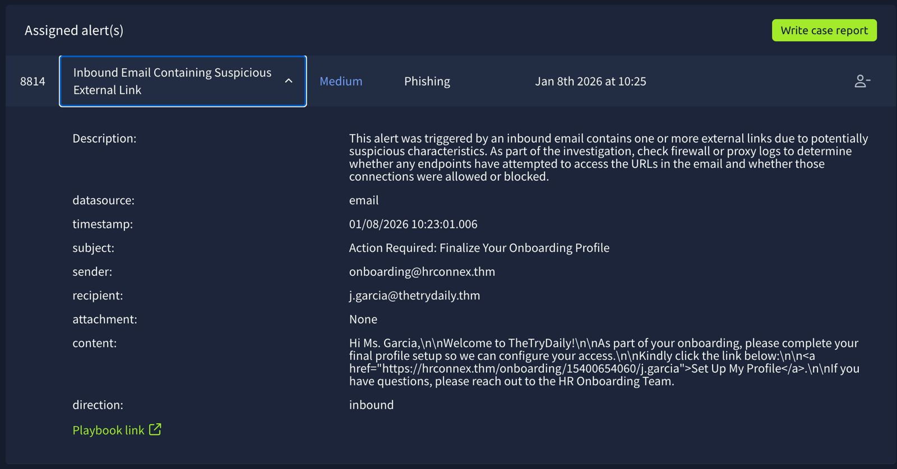

## Lab: Introduction to Phishing (SOC Simulator)
Scenario:  
Triaged alerts in a simulated SOC environment and closed all **True Positive alerts** to successfully complete the scenario.

## Alert Analysis & Investigation

---
# ALert 1

### False positive

Time of Activity: Jan 8th 2026 at 15:59

List of Related Entities: 
- sender: onboarding@hrconnex.thm
- recipient: j.garcia@thetrydaily.thm
- URL: https://hrconnex.thm/onboarding/15400654060/j.garcia
- direction: inbound

Reason for Classifying as False Positive: The email originates from a legitimate internal HR domain and contains a trusted URL. No indicators of phishing such as domain spoofing, malicious attachments, obfuscated links, or social engineering tactics were identified.

---
# ALert 2

### True positive

Time of activity: Jan 8th 2026 at 15:58

List of Affected Entities: 
- Sender address: no-reply@m1crosoftsupport.co
- Recipient address: c.allen@thetrydaily.thm
- URL: https://m1crosoftsupport.co/login
- Reported IP Address: 102.89.222.143
Data Source: Email Security Gateway

Reason for Classifying as True Positive: The email originates from a spoofed Microsoft look-alike domain (m1crosoftsupport.co) and contains a phishing link directing users to a fake login page. The message uses fear-based language and prompts immediate action.

Reason for Escalating the Alert: The alert was escalated due to the high likelihood of credential theft if the user interacted with the phishing link. At the time of investigation, no firewall or proxy logs confirmed outbound connections to the phishing domain; however, due to the impersonation of a trusted service and potential impact to user credentials, escalation was required for further validation and user follow-up.

Recommended Remediation Actions: 
- Block the sender domain and phishing URL across email and web security controls
- Review firewall and proxy logs to determine whether the phishing link was accessed
- Confirm with the user whether interaction occurred
- Reset account credentials if user interaction is confirmed
- Remove the email from all mailboxes and provide phishing awareness guidance

List of Attack Indicators: 
- Look-alike sender domain using Typosquatting (m1crosoft)
- Phishing login URL not associated with legitimate Microsoft domains
- Fear and urgency tactics related to account compromise
- Request to review activity via external link
- Impersonation of Microsoft security notifications

--- 
# ALert 3

### True positive

Time of activity: Jan 8th 2026 at 15:57

List of Affected Entities: 
- Source IP: 10.20.2.17
- Destination IP: 67.199.248.11
- URL: http://bit.ly/3sHkX3da12340
- Data Source: Firewall
- Action Taken: Blocked

Reason for Classifying as True Positive: The outbound connection was made to the URL present in the organization's blacklist or threat intelligence feeds. 

Reason for Escalating the Alert: Escalation is NOT required at this stage because the firewall successfully blocked the malicious request and no further suspicious activity was observed.

Recommended Remediation Actions: 
- Continue monitoring the source IP for repeated attempts
- Correlate with email security logs to identify potential phishing exposure
- Maintain URL blocklist enforcement
- No immediate endpoint remediation required due to lack of impact

List of Attack Indicators: 
- Blacklisted and known malicious URL
- URL shortener used for obfuscation
- Outbound connection attempt blocked by firewall

--- 
# ALert 4

### True positive

Time of activity: Jan 8th 2026 at 15:56

List of Affected Entities: 
Recipient Email: h.harris@thetrydaily.thm
Sender Email: urgents@amazon.biz
URL: http://bit.ly/3sHkX3da12340

Reason for Classifying as True Positive: The email originates from a spoofed Amazon domain and contains a shortened, obfuscated URL(http://bit.ly/3sHkX3da12340). It uses sense of urgency and asks the user to click a link to verify information, which are clear indicators of phishing activity.

Reason for Escalating the Alert:  It has confirmed phishing indicators including spoofed sender domain which appears as Amazon, an obfuscated shortened URL and sense of urgency to click the malicious URL which can contain the risk of credential compromise and there is high possibility that any user has clicked the link and the information has been shared.

Recommended Remediation Actions: 
- Block the sender domain and shortened URL
- Remove the email from user inboxes
- Review firewall/proxy logs to confirm whether the link was accessed
- Monitor the affected user for follow-on suspicious activity

List of Attack Indicators: 
- Spoofed sender domain impersonating Amazon (amazon.biz)
- Use of shortened and obfuscated URL (bit.ly)
- Generic greeting (“Dear Customer”)
- Urgency and threat-based language (48-hour deadline)
- Request to verify information via external link

---
# ALert 5

### False positive

Time of Activity: Jan 8th 2026 at 15:55

List of Related Entities: 
- sender: onboarding@hrconnex.thm
- recipient: j.garcia@thetrydaily.thm
- direction: inbound
- URL: https://hrconnex.thm/onboarding/15400654060/j.garcia

Reason for Classifying as False Positive: The alert was triggered due to the presence of an external link in an inbound email. Investigation confirmed that the sender domain (hrconnex.thm) and embedded URL are legitimate and align with expected HR onboarding activity. No suspicious indicators such as domain spoofing,  urgency, malicious attachments, etc were observed. Firewall/proxy review did not indicate malicious behavior.

---

## Outcome

- Successfully identified all **True Positive alerts**
- Correctly classified **False Positives**
- Demonstrated real-world SOC L1 investigation workflow
- Practiced escalation, remediation, and documentation standards
